# ROCKET LAUNCH

Welcome to Rocket Launch! Rocket Launch is a space based quiz game agains the clock, with the aim of the game being to launch the rocket. Users will answer space related questions aiming to get five correct answers within a thirty second time period to initiate the launch sequence and launch the rocket. Three incorrect answers will initiate the self destruct sequence and the rocket will explode. The site is aimed at people of all ages, particularly those with an interest in space. The quiz element of the site is intuitive and the timer and added jeopardy of the self destruct function add a layer of challenge and excitement. The site can be useful to young and old people hoping to learn a little more about space travel and exploration.
<!-- ⚠️⚠️⚠️⚠️⚠️ START OF NOTES (to be deleted) ⚠️⚠️⚠️⚠️⚠️

In this section, you will include a few paragraphs providing an overview of your project.
Essentially, this part is your "sales pitch".

At this stage, you should have a name for your project so use it!
Don't introduce the project as a "portfolio project" for the diploma.

In this section, describe what the project hopes to accomplish, who it is intended to target, and how it will be useful to the target audience.

Consider adding a mockup image using the "Am I Responsive" website.
Here's your deployed site as an example:
https://ui.dev/amiresponsive?url=https://jamesh003.github.io/Rocket-Launch

Screenshots for the README and testing should not be inside of `assets/` or `static/` image folders.
(reminder: `assets/` and `static/` are for files used on the live site, not documentation)
Consider adding a new folder called `documentation`, and add the amiresponsive screenshot inside of that folder.
To add the image into your README, use this format:
(assuming you have a new folder called `documentation` with an image called "mockup.png")


Note: Markdown files (.md) should not contain HTML elements like `img`, `br`, `div`, `a`, etc, only Markdown formatting.
Find out more about using Markdown elements here:
https://pandao.github.io/editor.md/en.html

🛑🛑🛑🛑🛑 END OF NOTES (to be deleted) 🛑🛑🛑🛑🛑 -->

## UX

As the quiz game is space related I wanted the design of the site to reflect this. As such I chose space themed images and bright neon, attention getting colours throughout the game. The landing page is clean and simple, featuring a background image of a striking nebula with a space shuttle in the center foreground. ---------/The text for the name of the game is bright, electric and prominent and the 'Begin Mission' button features a glow effect by means of a box shadow./--------
The site consists of two pages and uses modals to convey information to the user. I searched for samples of multiple choice quiz games to use as inspiration. I used this video as my inspiration for the basic structure and function of the game. I chose this one (https://www.youtube.com/watch?v=riDzcEQbX6k) as the quiz was clean, simple and very intuitive. I wanted to give the game somewhat of a realistic feel to it, so I elected to use real images of launch sites and an image of a space shuttle for the rocket. There are two different background images for the main quiz page and they change depending on the time of day of the location of the user.

<!-- ⚠️⚠️⚠️⚠️⚠️ START OF NOTES (to be deleted) ⚠️⚠️⚠️⚠️⚠️

In this section, you will briefly explain your design processes.

🛑🛑🛑🛑🛑 END OF NOTES (to be deleted) 🛑🛑🛑🛑🛑 -->

### Colour Scheme

<!-- ⚠️⚠️⚠️⚠️⚠️ START OF NOTES (to be deleted) ⚠️⚠️⚠️⚠️⚠️

Explain your colours and the colour scheme.

🛑🛑🛑🛑🛑 END OF NOTES (to be deleted) 🛑🛑🛑🛑🛑 -->

- `#00fffa;` used for primary text.
- `#0030ff;` used for primary highlights.
- `#fefefe;` used for secondary text.
- `#5C88EF` used for secondary highlights.
- `#d41111;` used for secondary highlights.
- `#1fc461` used for secondary highlights.

<!-- ⚠️⚠️⚠️⚠️⚠️ START OF NOTES (to be deleted) ⚠️⚠️⚠️⚠️⚠️

Consider adding a link and screenshot for your colour scheme using "coolors".
https://coolors.co/generate

When you add a colour to the palette, the URL is dynamically updated, making it easier for you to return back to your colour palette later if needed.

Example:

🛑🛑🛑🛑🛑 END OF NOTES (to be deleted) 🛑🛑🛑🛑🛑 -->

I used [coolors.co](https://coolors.co/00fffa-0030ff-fefefe-5c88ef-d41111-1fc461) to generate my colour palette.

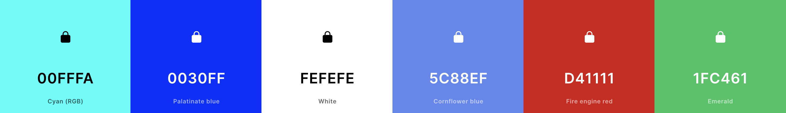

<!-- ⚠️⚠️⚠️⚠️⚠️ START OF NOTES (to be deleted) ⚠️⚠️⚠️⚠️⚠️

If you've used CSS `:root` variables, consider also including a code snippet here!

🛑🛑🛑🛑🛑 END OF NOTES (to be deleted) 🛑🛑🛑🛑🛑 -->

I've used CSS `:root` variables to easily update the global colour scheme by changing only one value, instead of everywhere in the CSS file.

```css
:root {
    --color-btn: #5C88EF;
    --color-incorrect-ans: #d41111;
    --color-correct-ans: #1fc461;
}
```

### Typography

<!-- ⚠️⚠️⚠️⚠️⚠️ START OF NOTES (to be deleted) ⚠️⚠️⚠️⚠️⚠️

Explain any fonts and icon libraries used, like Google Fonts and/or Font Awesome.

Consider adding a link to each font used, and the Font Awesome site if used (or similar icon library).

Example:

🛑🛑🛑🛑🛑 END OF NOTES (to be deleted) 🛑🛑🛑🛑🛑 -->

- [Space Mono](https://fonts.google.com/specimen/Space+Mono) was used for the primary headers and titles and all text.

- [Font Awesome](https://fontawesome.com) icons were used throughout the site, such as the social media icons in the footer.

## User Stories

<!-- ⚠️⚠️⚠️⚠️⚠️ START OF NOTES (to be deleted) ⚠️⚠️⚠️⚠️⚠️

In this section, list all of your user stories for the project.

🛑🛑🛑🛑🛑 END OF NOTES (to be deleted) 🛑🛑🛑🛑🛑 -->

### New Site Users

- As a new site user, I would like to understand the purpose of the site, so that I can decide if I want to use it.
- As a new site user, I would like to understand the aim of the game, so that I can maximise my chances .
- As a new site user, I would like to see strong enticing visuals, so that I can enjoy the experience.
- As a new site user, I would like to readily understand the layout of the game/quiz, so that I don't waste time figuring it out.
- As a new site user, I would like to be able to control any sound, so that I can tailor my experience to my needs.
- As a new site user, I would like there to be an element of jeopardy to the game, to increase my gaming experience.

### Returning Site Users

- As a returning site user, I would like to have a random selection of quesions, so that I can attempt the game multiple times.
- As a returning site user, I would like to be able to see my previous scores, so that I can attempt to improve on them.

## Wireframes

<!-- ⚠️⚠️⚠️⚠️⚠️ START OF NOTES (to be deleted) ⚠️⚠️⚠️⚠️⚠️

In this section, display your wireframe screenshots using a Markdown `table`.

Instructions on how to do Markdown `tables` start on line #213 on this site: https://pandao.github.io/editor.md/en.html

🛑🛑🛑🛑🛑 END OF NOTES (to be deleted) 🛑🛑🛑🛑🛑 -->

To follow best practice, wireframes were developed for mobile and desktop sizes.
I've used [Balsamiq](https://balsamiq.com/wireframes) to design my site wireframes.

### Home Page Wireframes

<details>
<summary>Click to see the Home Page Wireframes</summary>

| Size | Screenshot |
| --- | --- |
| Mobile | 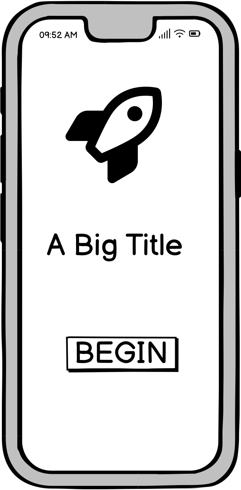 |
| Desktop | 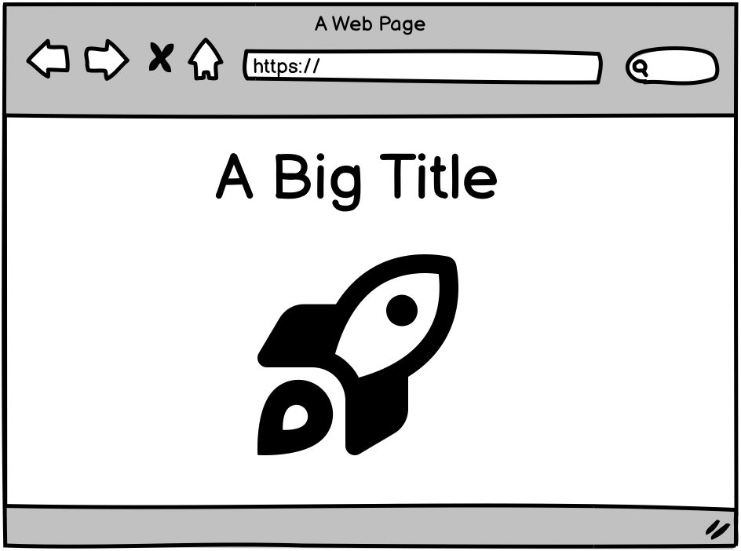 |

</details>

### Rules Page Wireframes

<details>
<summary>Click to see the Rules Page Wireframes</summary>

| Size | Screenshot |
| --- | --- |
| Mobile | 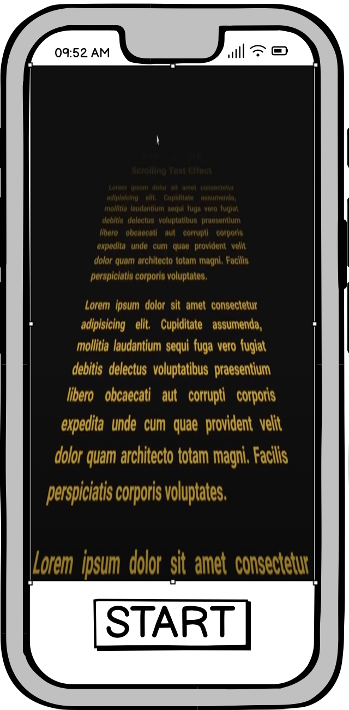 |
| Desktop | 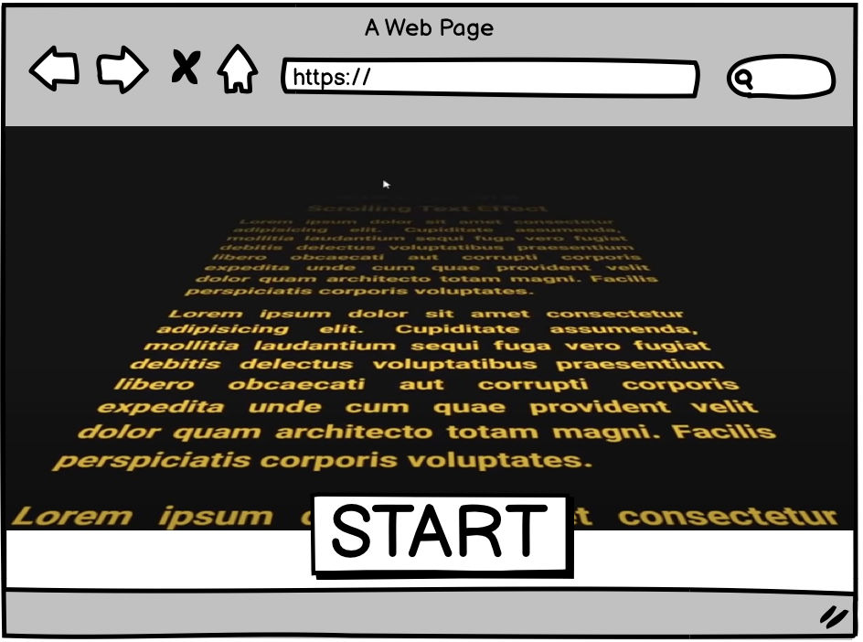 |

</details>

### Quiz Page Wireframes

<details>
<summary>Click to see the Quiz Page Wireframes</summary>

| Size | Screenshot |
| --- | --- |
| Mobile | 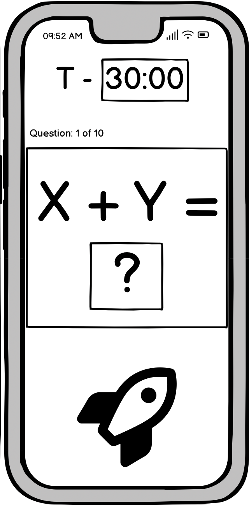 |
| Desktop | 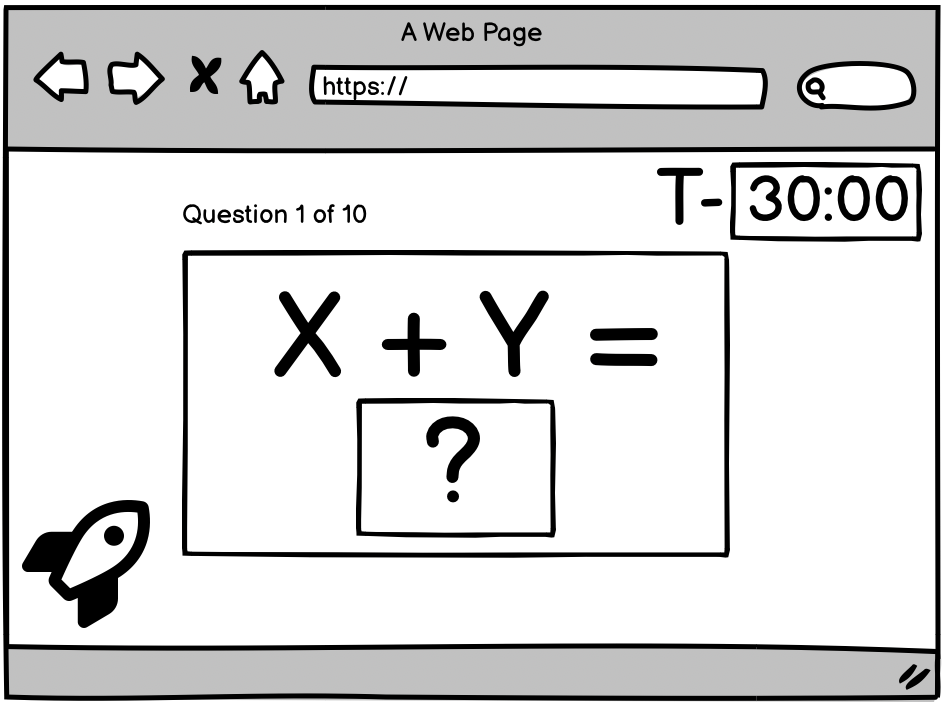 |

</details>

### Launch Page Wireframes

<details>
<summary>Click to see the Launch Page Wireframes</summary>

| Size | Screenshot |
| --- | --- |
| Mobile | 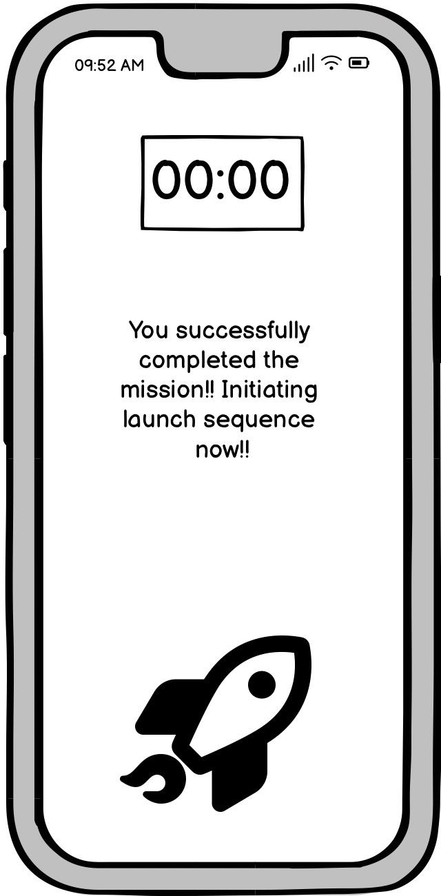 |
| Desktop | 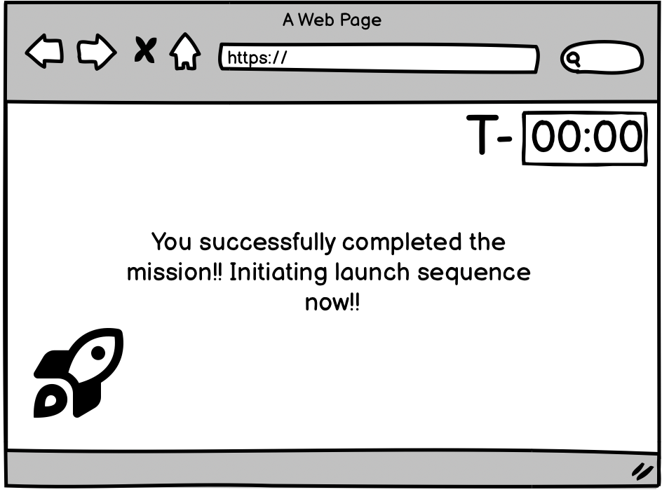 |

</details>

### Self Destruct Page Wireframes

<details>
<summary>Click to see the Self Destruct Page Wireframes</summary>

| Size | Screenshot |
| --- | --- |
| Mobile | 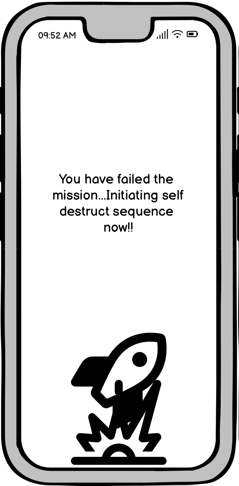 |
| Desktop | 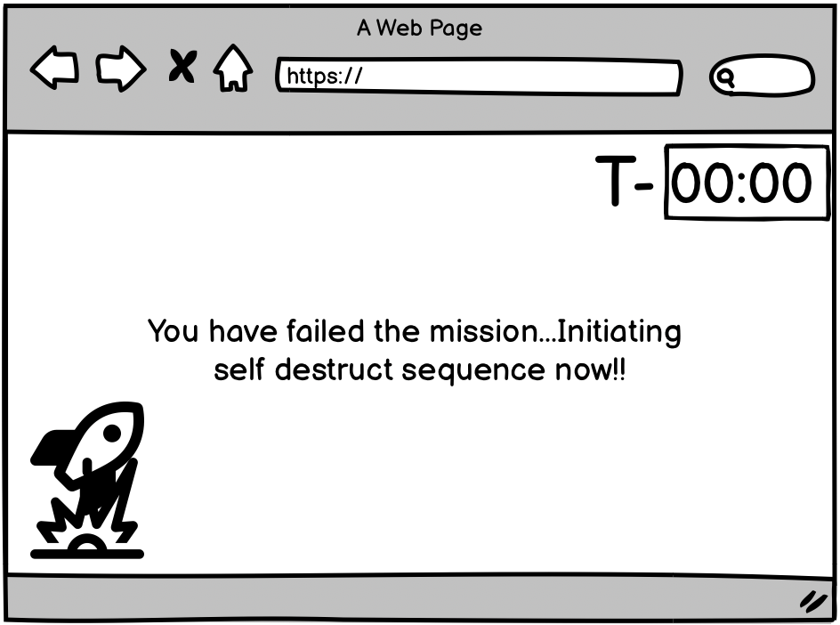 |

</details>

### Play Again Page Wireframes

<details>
<summary>Click to see the Play Again Page Wireframes</summary>

| Size | Screenshot |
| --- | --- |
| Mobile | 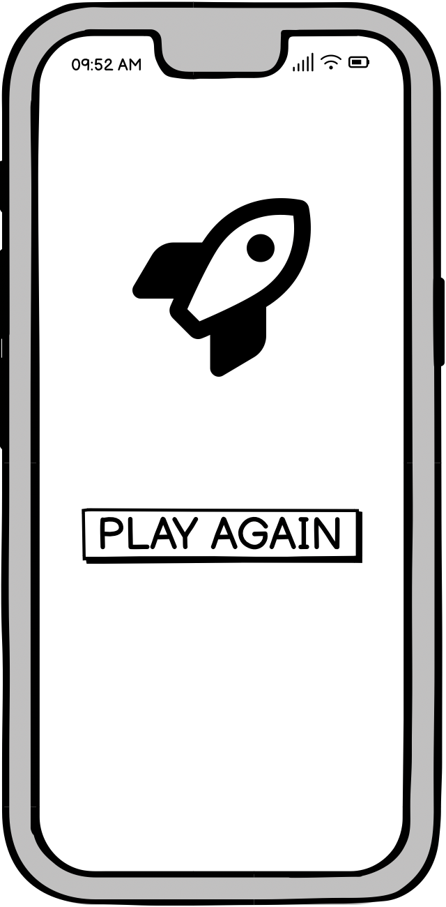 |
| Desktop | 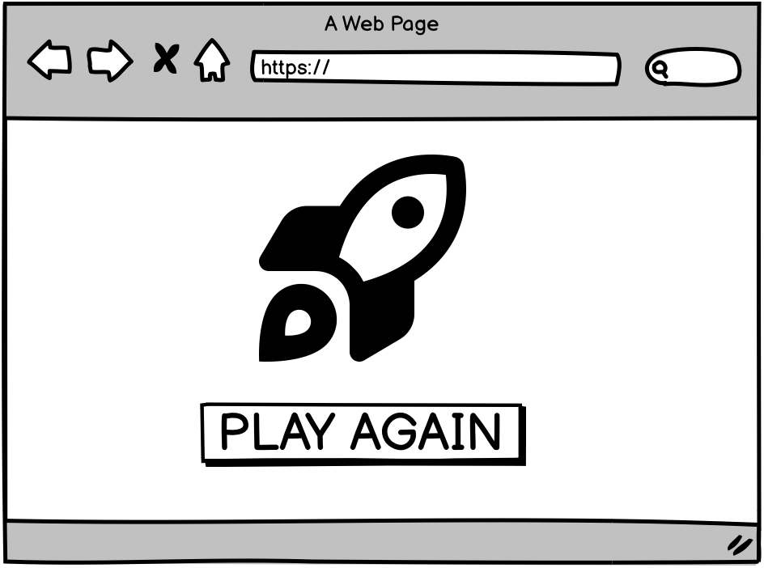 |

</details>


<!-- ⚠️⚠️⚠️⚠️⚠️ START OF NOTES (to be deleted) ⚠️⚠️⚠️⚠️⚠️

Repeat for any addition wireframe pages you have.

🛑🛑🛑🛑🛑 END OF NOTES (to be deleted) 🛑🛑🛑🛑🛑 -->

## Features

<!-- ⚠️⚠️⚠️⚠️⚠️ START OF NOTES (to be deleted) ⚠️⚠️⚠️⚠️⚠️

In this section, you should go over the different parts of your project,
and describe each in a sentence or so.

You will need to explain what value each of the features provides for the user,
focusing on who this website is for, what it is that they want to achieve,
and how your project is the best way to help them achieve these things.

For some/all of your features, you may choose to reference the specific project files that implement them.

IMPORTANT: Remember to always include a screenshot of each individual feature!

🛑🛑🛑🛑🛑 END OF NOTES (to be deleted) 🛑🛑🛑🛑🛑 -->

### Existing Features

- **Landing page**

    - The landing page features a striking background image of a colourful nebula, with an image of a rocket in the foreground. The title and name of the quiz game is displayed in light blue with a text shadow and large font to emphasise the text. There is a 'Begin Mission' at the bottom of the page with a box shadow, giving the button an emphatic glow. The rocket features a 'shake' animation, giving it the impression of being about to launch.

        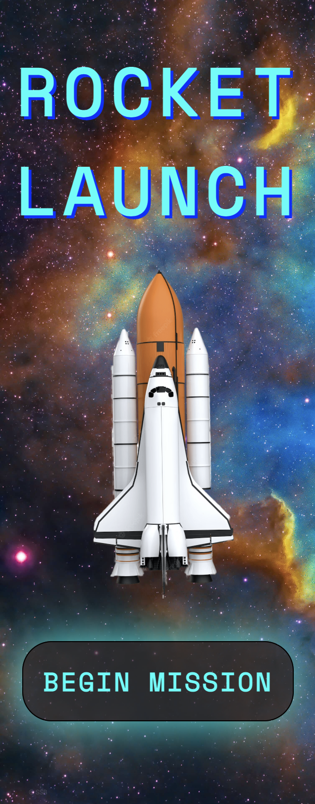

- **Control buttons**

    - On first loading quiz.html, there are two prominent buttons in the center of the screen. These are the main control buttons, one for displaying the rules modal to the user and the other to commence the quiz game. Both buttons consist of white text with a blue background. They are clear, defined and intuitive in terms of functionality. 

        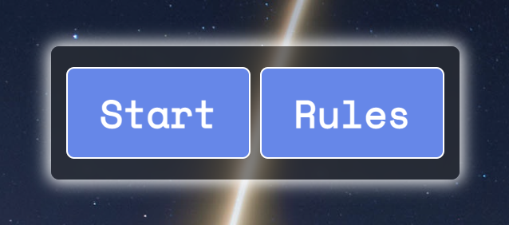

- **Secondary control buttons**

    - In the top right corner there are three secondary control buttons for site controls. The first is a navigation link to return to the landing page, utilising a house icon from Font Awesome. The second is an unmute button for sound effects in the game, utilising a speaker icon from Font Awesome. The third is a reset button to reload the page should the user wish to restart the game, utilising a curved arrows icon from Font Awesome. The icons greatly add to the user experience as they grant the user more control over their experience. The volume control element is intuitive in that is displays the current status in terms of muted or unmuted. Once clicked it will change to the opposite state.

        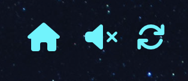

- **Background image**

    - The background image on the quiz page is responsive to the time of day of the user. Depending on the time of day of where the user is, the background image will either feature a day scene or night scene. Between the hours of 7am and 6pm, the background image will feature a day scene of a launch pad by the coast with a bright blue sky. Between the hours of 6pm and 7am, the background image will feature a night scene of a launch pad by the coast with a dark night sky.

        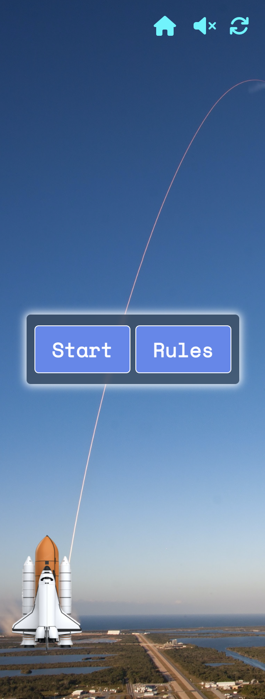 
        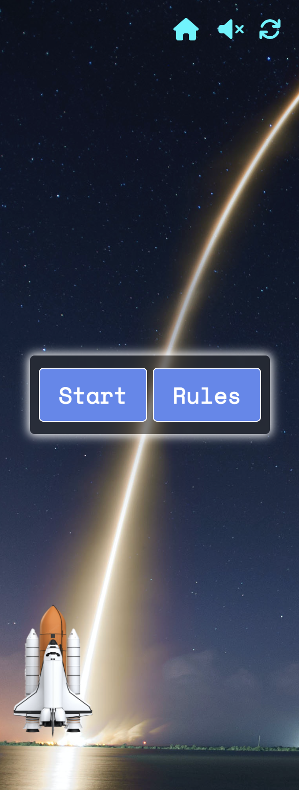

- **Rules modal**

    - Upon clicking the 'Rules' button, a modal is opened. This conveys the instuctions and rules of the game to the user. The modal consists of light blue text on a contrasting black background. There is also a box shadow effect around the modal consistent with the neon space theme throughout.

        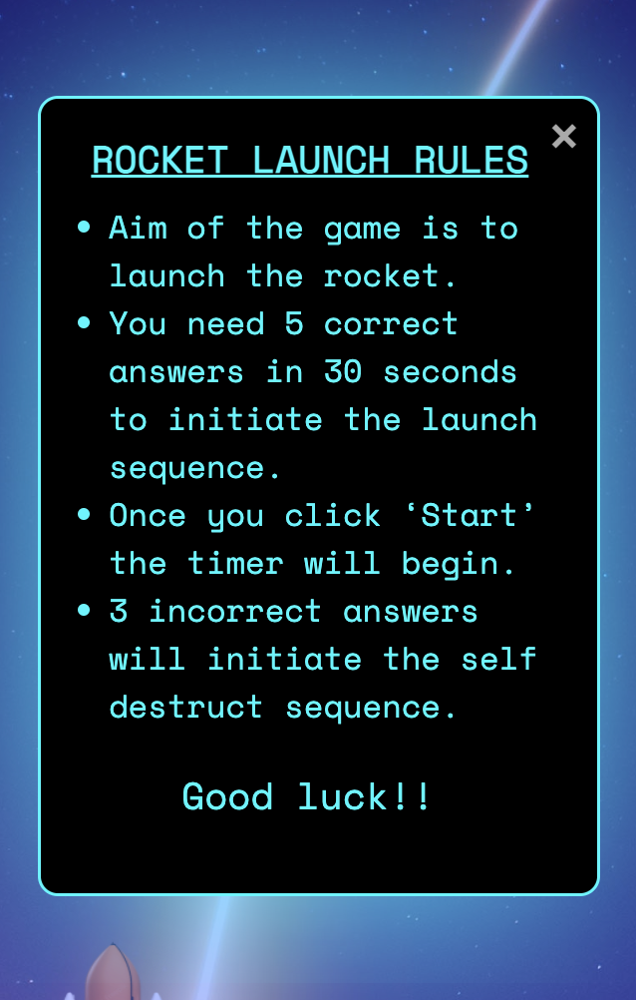

- **Quiz game layout**

    - The quiz page consists of clearly defined and intuitive sections for the user. At the top is the score board, which tracks the number of correct and incorrect answers. The box in the center of the page features the question being asked and four answer buttons. At the bottom there is a 30 second timer which begins once the 'Start' button is pressed. 

        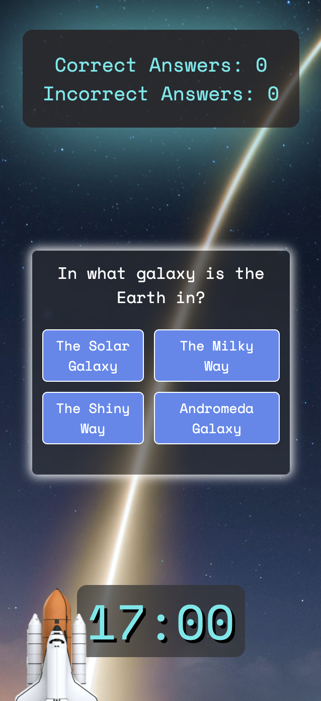

- **Correct and Incorrect features**

    - When the user selects an answer button, the button itself will turn green or red depending on whether the selected answer was correct or incorrect. The box shadow effect around the question card will also increase in size and change to either green or red. This enhances the user experience as there is no ambiguity and also a pleasing visual experience.

        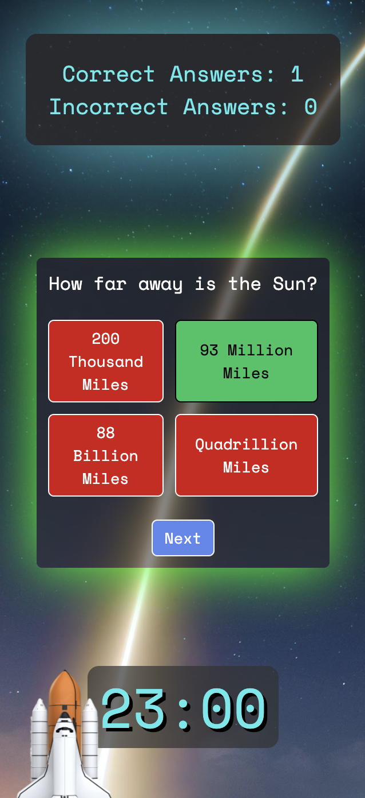
        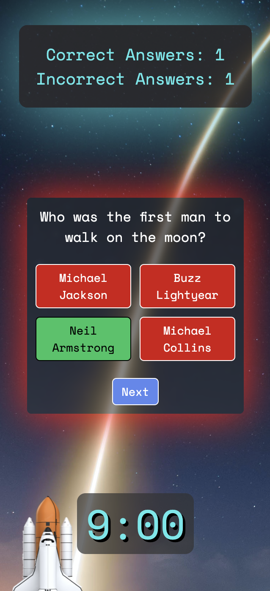

- **T-minus countdown**

     - Upon reaching either 5 correct answers or 3 incorrect answers the screen will automatically clear and a 5 second countdown timer will appear. This is the countdown to either the launch sequence or the self-destruct sequence. The 'T-minus' element is another feature consistent with rocketry and space travel.

        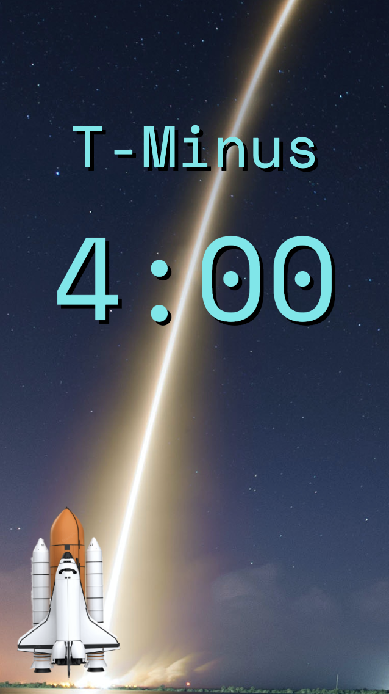
        

- **Launch sequence**

    - Once 5 correct answers has been achieved with the 30 second timeframe, the launch sequence will be initiated. This consists of the rocket launching and flying up towards the top of the screen and disappearing into the distance. The user has the option of unmuting the sound and will hear a sound effect of a rocket launching. This is the successful culmination of the game and will give the user a feeling of satisfaction. 

        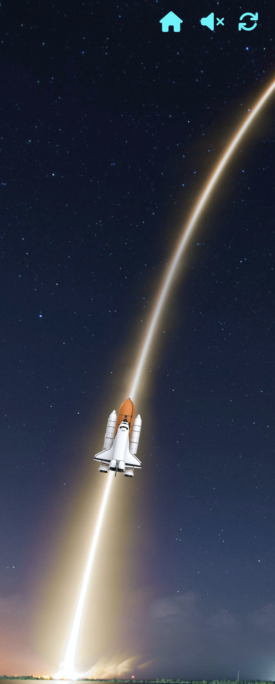
        

- **Twinkle feature**

    - As the rocket disappears into the distance a twinkle feature appears to represent the rocket disappearing into deep space. The user has the option of unmuting the sound and will hear a satisying ding sound as the twinkle appears.

        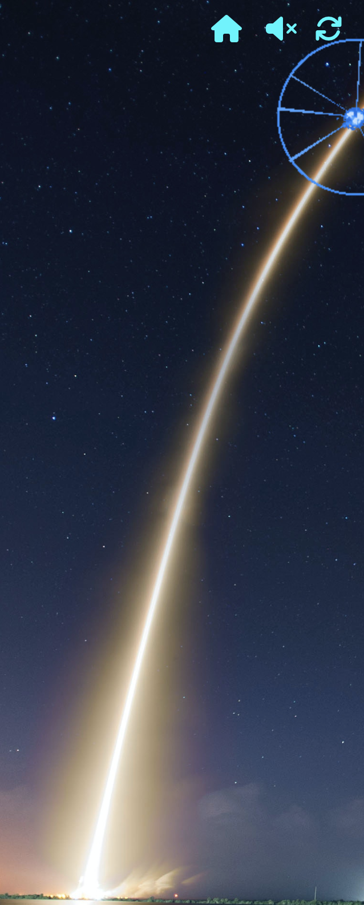

- **Congratulations modal**

    - Upon succesful launching of the rocket a modal appears at the end. This conveys a message congratulating the user and offering them the chance to play again. The styling of the modal is consistent with the rest of the game and features a neon space theme and a successful green glow in the form of a box shadow.

        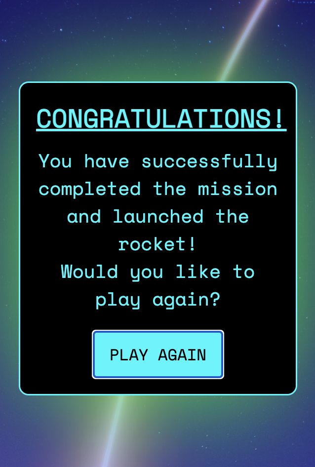

- **Self Destruct sequence**

    - Once 3 incorrect answers have been registered the self destruct sequence will be triggered. This features an explosion gif and subsequent fire gif. The user has the option of unmuting the sound and will hear an explosion sound effect followed by a fire sound effect. The dramatic explosion and fire features add a degree of jeopardy and increases the sense of challenge and excitment to the user.

        

- **Fail modal**

    - Upon completion of the self-destruct sequence a modal appears at the end. This conveys a message stating the the user has failed the mission and offers them the chance to try again. The styling of the modal is consistent with the rest of the game and features a neon space theme and a red glow in the form of a box shadow synonymous with failure.

        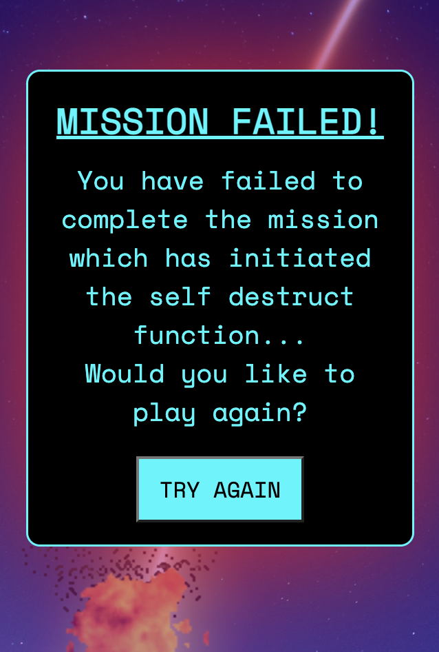


<!-- ⚠️⚠️⚠️⚠️⚠️ START OF NOTES (to be deleted) ⚠️⚠️⚠️⚠️⚠️

Repeat as necessary for as many features as your site contains.

Hint: the more, the merrier!

🛑🛑🛑🛑🛑 END OF NOTES (to be deleted) 🛑🛑🛑🛑🛑 -->

### Future Features

<!-- ⚠️⚠️⚠️⚠️⚠️ START OF NOTES (to be deleted) ⚠️⚠️⚠️⚠️⚠️

Do you have additional ideas that you'd like to include on your project in the future?
Fantastic! List them here!
It's always great to have plans for future improvements!
Consider adding any helpful links or notes to help remind you in the future, if you revisit the project in a couple years.

🛑🛑🛑🛑🛑 END OF NOTES (to be deleted) 🛑🛑🛑🛑🛑 -->

- Title for future feature #1
    - Any additional notes about this feature.
- Title for future feature #2
    - Any additional notes about this feature.
- Title for future feature #3
    - Any additional notes about this feature.

## Tools & Technologies Used

<!-- ⚠️⚠️⚠️⚠️⚠️ START OF NOTES (to be deleted) ⚠️⚠️⚠️⚠️⚠️

In this section, you should explain the various tools and technologies used to develop the project.
Make sure to put a link (where applicable) to the source, and explain what each was used for.
Some examples have been provided, but this is just a sample only, your project might've used others.
Feel free to delete any unused items below as necessary.

🛑🛑🛑🛑🛑 END OF NOTES (to be deleted) 🛑🛑🛑🛑🛑 -->

- [HTML](https://en.wikipedia.org/wiki/HTML) used for the main site content.
- [CSS](https://en.wikipedia.org/wiki/CSS) used for the main site design and layout.
- [CSS :root variables](https://www.w3schools.com/css/css3_variables.asp) used for reusable styles throughout the site.
- [CSS Flexbox](https://www.w3schools.com/css/css3_flexbox.asp) used for an enhanced responsive layout.
- [CSS Grid](https://www.w3schools.com/css/css_grid.asp) used for an enhanced responsive layout.
- [JavaScript](https://www.javascript.com) used for user interaction on the site.
- [Python](https://www.python.org) used as the back-end programming language.
- [Git](https://git-scm.com) used for version control. (`git add`, `git commit`, `git push`)
- [GitHub](https://github.com) used for secure online code storage.
- [GitHub Pages](https://pages.github.com) used for hosting the deployed front-end site.
- [Gitpod](https://gitpod.io) used as a cloud-based IDE for development.
- [Bootstrap](https://getbootstrap.com) used as the front-end CSS framework for modern responsiveness and pre-built components.
- [Materialize](https://materializecss.com) used as the front-end CSS framework for modern responsiveness and pre-built components.
- [Flask](https://flask.palletsprojects.com) used as the Python framework for the site.
- [Django](https://www.djangoproject.com) used as the Python framework for the site.
- [MongoDB](https://www.mongodb.com) used as the non-relational database management with Flask.
- [SQLAlchemy](https://www.sqlalchemy.org) used as the relational database management with Flask.
- [PostgreSQL](https://www.postgresql.org) used as the relational database management.
- [ElephantSQL](https://www.elephantsql.com) used as the Postgres database.
- [Heroku](https://www.heroku.com) used for hosting the deployed back-end site.
- [Cloudinary](https://cloudinary.com) used for online static file storage.
- [Stripe](https://stripe.com) used for online secure payments of ecommerce products/services.
- [AWS S3](https://aws.amazon.com/s3) used for online static file storage.

## Testing

For all testing, please refer to the [TESTING.md](TESTING.md) file.

## Deployment

The site was deployed to GitHub Pages. The steps to deploy are as follows:
- In the [GitHub repository](https://github.com/JamesH003/Rocket-Launch), navigate to the Settings tab 
- From the source section drop-down menu, select the **Main** Branch, then click "Save".
- The page will be automatically refreshed with a detailed ribbon display to indicate the successful deployment.

The live link can be found [here](https://jamesh003.github.io/Rocket-Launch)

### Local Deployment

This project can be cloned or forked in order to make a local copy on your own system.

#### Cloning

You can clone the repository by following these steps:

1. Go to the [GitHub repository](https://github.com/JamesH003/Rocket-Launch) 
2. Locate the Code button above the list of files and click it 
3. Select if you prefer to clone using HTTPS, SSH, or GitHub CLI and click the copy button to copy the URL to your clipboard
4. Open Git Bash or Terminal
5. Change the current working directory to the one where you want the cloned directory
6. In your IDE Terminal, type the following command to clone my repository:
	- `git clone https://github.com/JamesH003/Rocket-Launch.git`
7. Press Enter to create your local clone.

Alternatively, if using Gitpod, you can click below to create your own workspace using this repository.

[](https://gitpod.io/#https://github.com/JamesH003/Rocket-Launch)

Please note that in order to directly open the project in Gitpod, you need to have the browser extension installed.
A tutorial on how to do that can be found [here](https://www.gitpod.io/docs/configure/user-settings/browser-extension).

#### Forking

By forking the GitHub Repository, we make a copy of the original repository on our GitHub account to view and/or make changes without affecting the original owner's repository.
You can fork this repository by using the following steps:

1. Log in to GitHub and locate the [GitHub Repository](https://github.com/JamesH003/Rocket-Launch)
2. At the top of the Repository (not top of page) just above the "Settings" Button on the menu, locate the "Fork" Button.
3. Once clicked, you should now have a copy of the original repository in your own GitHub account!

### Local VS Deployment

<!-- ⚠️⚠️⚠️⚠️⚠️ START OF NOTES (to be deleted) ⚠️⚠️⚠️⚠️⚠️

Use this space to discuss any differences between the local version you've developed, and the live deployment site on GitHub Pages.

🛑🛑🛑🛑🛑 END OF NOTES (to be deleted) 🛑🛑🛑🛑🛑 -->

## Credits

<!-- ⚠️⚠️⚠️⚠️⚠️ START OF NOTES (to be deleted) ⚠️⚠️⚠️⚠️⚠️

In this section you need to reference where you got your content, media, and extra help from.
It is common practice to use code from other repositories and tutorials,
however, it is important to be very specific about these sources to avoid plagiarism.

🛑🛑🛑🛑🛑 END OF NOTES (to be deleted) 🛑🛑🛑🛑🛑 -->

### Content

<!-- ⚠️⚠️⚠️⚠️⚠️ START OF NOTES (to be deleted) ⚠️⚠️⚠️⚠️⚠️

Use this space to provide attribution links to any borrowed code snippets, elements, or resources.
A few examples have been provided below to give you some ideas.

Ideally, you should provide an actual link to every resource used, not just a generic link to the main site!

🛑🛑🛑🛑🛑 END OF NOTES (to be deleted) 🛑🛑🛑🛑🛑 -->

| Source | Location | Notes |
| --- | --- | --- |
| [Markdown Builder](https://traveltimn.github.io/markdown-builder) | README and TESTING | tool to help generate the Markdown files |
| [Chris Beams](https://chris.beams.io/posts/git-commit) | version control | "How to Write a Git Commit Message" |
| [W3Schools](https://www.w3schools.com/howto/howto_js_topnav_responsive.asp) | entire site | responsive HTML/CSS/JS navbar |
| [W3Schools](https://www.w3schools.com/howto/howto_css_modals.asp) | contact page | interactive pop-up (modal) |
| [W3Schools](https://www.w3schools.com/css/css3_variables.asp) | entire site | how to use CSS :root variables |
| [Flexbox Froggy](https://flexboxfroggy.com/) | entire site | modern responsive layouts |
| [Grid Garden](https://cssgridgarden.com) | entire site | modern responsive layouts |
| [StackOverflow](https://stackoverflow.com/a/2450976) | quiz page | Fisher-Yates/Knuth shuffle in JS |
| [YouTube](https://www.youtube.com/watch?v=YL1F4dCUlLc) | leaderboard | using `localStorage()` in JS for high scores |
| [YouTube](https://www.youtube.com/watch?v=u51Zjlnui4Y) | PP3 terminal | tutorial for adding color to the Python terminal |
| [strftime](https://strftime.org) | CRUD functionality | helpful tool to format date/time from string |
| [WhiteNoise](http://whitenoise.evans.io) | entire site | hosting static files on Heroku temporarily |

### Media

<!-- ⚠️⚠️⚠️⚠️⚠️ START OF NOTES (to be deleted) ⚠️⚠️⚠️⚠️⚠️

Use this space to provide attribution links to any images, videos, or audio files borrowed from online.
A few examples have been provided below to give you some ideas.

If you're the owner (or a close acquaintance) of all media files, then make sure to specify this.
Let the assessors know that you have explicit rights to use the media files within your project.

Ideally, you should provide an actual link to every media file used, not just a generic link to the main site!
The list below is by no means exhaustive. Within the Code Institute Slack community, you can find more "free media" links
by sending yourself the following command: `!freemedia`.

🛑🛑🛑🛑🛑 END OF NOTES (to be deleted) 🛑🛑🛑🛑🛑 -->

| Source | Location | Type | Notes |
| --- | --- | --- | --- |
| [Pexels](https://www.pexels.com) | entire site | image | favicon on all pages |
| [Lorem Picsum](https://picsum.photos) | home page | image | hero image background |
| [Unsplash](https://unsplash.com) | product page | image | sample of fake products |
| [Pixabay](https://pixabay.com) | gallery page | image | group of photos for gallery |
| [Wallhere](https://wallhere.com) | footer | image | background wallpaper image in the footer |
| [This Person Does Not Exist](https://thispersondoesnotexist.com) | testimonials | image | headshots of fake testimonial images |
| [Audio Micro](https://www.audiomicro.com/free-sound-effects) | game page | audio | free audio files to generate the game sounds |
| [Videvo](https://www.videvo.net/) | home page | video | background video on the hero section |
| [TinyPNG](https://tinypng.com) | entire site | image | tool for image compression |

### Acknowledgements

<!-- ⚠️⚠️⚠️⚠️⚠️ START OF NOTES (to be deleted) ⚠️⚠️⚠️⚠️⚠️

Use this space to provide attribution to any supports that helped, encouraged, or supported you throughout the development stages of this project.
A few examples have been provided below to give you some ideas.

🛑🛑🛑🛑🛑 END OF NOTES (to be deleted) 🛑🛑🛑🛑🛑 -->

- I would like to thank my Code Institute mentor, [Tim Nelson](https://github.com/TravelTimN) for their support throughout the development of this project.
- I would like to thank the [Code Institute](https://codeinstitute.net) tutor team for their assistance with troubleshooting and debugging some project issues.
- I would like to thank the [Code Institute Slack community](https://code-institute-room.slack.com) for the moral support; it kept me going during periods of self doubt and imposter syndrome.
- I would like to thank my partner (John/Jane), for believing in me, and allowing me to make this transition into software development.
- I would like to thank my employer, for supporting me in my career development change towards becoming a software developer.
