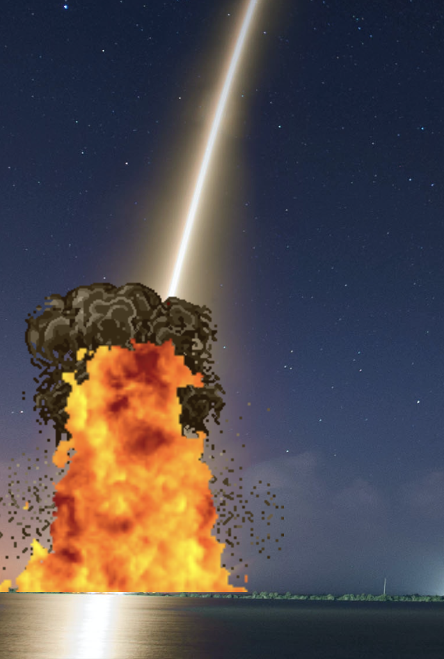

# ROCKET LAUNCH

Welcome to Rocket Launch! Rocket Launch is a space based quiz game against the clock, with the aim of the game being to launch the rocket. Users will answer space related questions aiming to get five correct answers within a thirty second time period to initiate the launch sequence and launch the rocket. Three incorrect answers will initiate the self destruct sequence and the rocket will explode. The site is aimed at people of all ages, particularly those with an interest in space. The quiz element of the site is intuitive and the timer and added jeopardy of the self destruct function add a layer of challenge and excitement. The site can be useful to young and old people hoping to learn a little more about space travel and exploration.


## UX

As the quiz game is space related I wanted the design of the site to reflect this. As such I chose space themed images and bright neon, attention getting colours throughout the game. The landing page is clean and simple, featuring a background image of a striking nebula with a space shuttle in the center foreground. The text for the name of the game is bright, electric and prominent and the 'Begin Mission' button features a glow effect by means of a box shadow. The site consists of two pages and uses modals to convey information to the user. I searched for samples of multiple choice quiz games to use as inspiration. I used this video as my inspiration for the basic structure and function of the game. I chose this one (https://www.youtube.com/watch?v=riDzcEQbX6k) as the quiz was clean, simple and very intuitive. I wanted to give the game somewhat of a realistic feel to it, so I elected to use real images of launch sites and an image of a space shuttle for the rocket. There are two different background images for the main quiz page and they change depending on the time of day of the location of the user.

### Colour Scheme

- `#00fffa;` used for primary text.
- `#0030ff;` used for primary highlights.
- `#fefefe;` used for secondary text.
- `#5C88EF` used for secondary highlights.
- `#d41111;` used for secondary highlights.
- `#1fc461` used for secondary highlights.

I used [coolors.co](https://coolors.co/00fffa-0030ff-fefefe-5c88ef-d41111-1fc461) to generate my colour palette.


I've used CSS `:root` variables to easily update the global colour scheme by changing only one value, instead of everywhere in the CSS file.

```css
:root {
    --color-btn: #5C88EF;
    --color-incorrect-ans: #d41111;
    --color-correct-ans: #1fc461;
}
```

### Typography

- [Space Mono](https://fonts.google.com/specimen/Space+Mono) was used for the primary headers and titles and all text.

- [Font Awesome](https://fontawesome.com) icons were used on the site, such as the home, mute/unmute and reset icons in the top-right corner of the quiz page.

## User Stories

### New Site Users

- As a new site user, I would like to understand the purpose of the site, so that I can decide if I want to use it.
- As a new site user, I would like to understand the aim of the game, so that I can maximise my chances.
- As a new site user, I would like to see strong enticing visuals, so that I can enjoy the experience.
- As a new site user, I would like to readily understand the layout of the game/quiz, so that I don't waste time figuring it out.
- As a new site user, I would like to be able to control any sound, so that I can tailor my experience to my needs.
- As a new site user, I would like there to be an element of jeopardy to the game, to increase my gaming experience.

### Returning Site Users

- As a returning site user, I would like to have a random selection of quesions, so that I can attempt the game multiple times.

## Wireframes

To follow best practice, wireframes were developed for mobile and desktop sizes.
I've used [Balsamiq](https://balsamiq.com/wireframes) to design my site wireframes.

### Home Page Wireframes

<details>
<summary>Click to see the Home Page Wireframes</summary>

| Size | Screenshot |
| --- | --- |
| Mobile |  |
| Desktop |  |

</details>

### Rules Page Wireframes

<details>
<summary>Click to see the Rules Page Wireframes</summary>

| Size | Screenshot |
| --- | --- |
| Mobile |  |
| Desktop |  |

</details>

### Quiz Page Wireframes

<details>
<summary>Click to see the Quiz Page Wireframes</summary>

| Size | Screenshot |
| --- | --- |
| Mobile |  |
| Desktop |  |

</details>

### Launch Page Wireframes

<details>
<summary>Click to see the Launch Page Wireframes</summary>

| Size | Screenshot |
| --- | --- |
| Mobile |  |
| Desktop |  |

</details>

### Self Destruct Page Wireframes

<details>
<summary>Click to see the Self Destruct Page Wireframes</summary>

| Size | Screenshot |
| --- | --- |
| Mobile |  |
| Desktop |  |

</details>

### Play Again Page Wireframes

<details>
<summary>Click to see the Play Again Page Wireframes</summary>

| Size | Screenshot |
| --- | --- |
| Mobile |  |
| Desktop |  |

</details>

## Features

### Existing Features

- **Landing page**

    - The landing page features a striking background image of a colourful nebula, with an image of a rocket in the foreground. The title and name of the quiz game is displayed in light blue with a text shadow and large font to emphasise the text. There is a 'Begin Mission' at the bottom of the page with a box shadow, giving the button an emphatic glow. The rocket features a 'shake' animation, giving it the impression of being about to launch.

        

- **Control buttons**

    - On first loading quiz.html, there are two prominent buttons in the center of the screen. These are the main control buttons, one for displaying the rules modal to the user and the other to commence the quiz game. Both buttons consist of white text with a blue background. They are clear, defined and intuitive in terms of functionality. 

        

- **Secondary control buttons**

    - In the top right corner there are three secondary control buttons for site controls. The first is a navigation link to return to the landing page, utilising a house icon from Font Awesome. The second is an unmute button for sound effects in the game, utilising a speaker icon from Font Awesome. The third is a reset button to reload the page should the user wish to restart the game, utilising a curved arrows icon from Font Awesome. The icons greatly add to the user experience as they grant the user more control over their experience. The volume control element is intuitive in that is displays the current status in terms of muted or unmuted. Once clicked it will change to the opposite state.

        

- **Background image**

    - The background image on the quiz page is responsive to the time of day of the user. Depending on the time of day of where the user is, the background image will either feature a day scene or night scene. Between the hours of 7am and 6pm, the background image will feature a day scene of a launch pad by the coast with a bright blue sky. Between the hours of 6pm and 7am, the background image will feature a night scene of a launch pad by the coast with a dark night sky.

         
        

- **Rules modal**

    - Upon clicking the 'Rules' button, a modal is opened. This conveys the instuctions and rules of the game to the user. The modal consists of light blue text on a contrasting black background. There is also a box shadow effect around the modal consistent with the neon space theme throughout.

        

- **Quiz game layout**

    - The quiz page consists of clearly defined and intuitive sections for the user. At the top is the score board, which tracks the number of correct and incorrect answers. The box in the center of the page features the question being asked and four answer buttons. At the bottom there is a 30 second timer which begins once the 'Start' button is pressed. 

        

- **Correct and Incorrect features**

    - When the user selects an answer button, the button itself will turn green or red depending on whether the selected answer was correct or incorrect. The box shadow effect around the question card will also increase in size and change to either green or red. This enhances the user experience as there is no ambiguity and also a pleasing visual experience.

        
        

- **T-minus countdown**

     - Upon reaching either 5 correct answers or 3 incorrect answers the screen will automatically clear and a 5 second countdown timer will appear. This is the countdown to either the launch sequence or the self-destruct sequence. The 'T-minus' element is another feature consistent with rocketry and space travel.

        
        

- **Launch sequence**

    - Once 5 correct answers has been achieved with the 30 second timeframe, the launch sequence will be initiated. This consists of the rocket launching and flying up towards the top of the screen and disappearing into the distance. The user has the option of unmuting the sound and will hear a sound effect of a rocket launching. This is the successful culmination of the game and will give the user a feeling of satisfaction. 

        
        

- **Twinkle feature**

    - As the rocket disappears into the distance a twinkle feature appears to represent the rocket disappearing into deep space. The user has the option of unmuting the sound and will hear a satisying ding sound as the twinkle appears.

        

- **Congratulations modal**

    - Upon succesful launching of the rocket a modal appears at the end. This conveys a message congratulating the user and offering them the chance to play again. The styling of the modal is consistent with the rest of the game and features a neon space theme and a successful green glow in the form of a box shadow.

        

- **Self Destruct sequence**

    - Once 3 incorrect answers have been registered the self destruct sequence will be triggered. This features an explosion gif and subsequent fire gif. The user has the option of unmuting the sound and will hear an explosion sound effect followed by a fire sound effect. The dramatic explosion and fire features add a degree of jeopardy and increases the sense of challenge and excitment to the user.

        

- **Fail modal**

    - Upon completion of the self-destruct sequence a modal appears at the end. This conveys a message stating the the user has failed the mission and offers them the chance to try again. The styling of the modal is consistent with the rest of the game and features a neon space theme and a red glow in the form of a box shadow synonymous with failure.

        


### Future Features

- User profile
    - Option to add a username and personalise the features to each user accordingly.
- Additional question categories 
    - Increase quantity and categories of questions in the game.
- Leaderboard
    - Option to track each indidual users score and rank them in a leaderboard.

## Tools & Technologies Used

- [HTML](https://en.wikipedia.org/wiki/HTML) used for the main site content.
- [CSS](https://en.wikipedia.org/wiki/CSS) used for the main site design and layout.
- [CSS :root variables](https://www.w3schools.com/css/css3_variables.asp) used for reusable styles throughout the site.
- [CSS Flexbox](https://www.w3schools.com/css/css3_flexbox.asp) used for an enhanced responsive layout.
- [CSS Grid](https://www.w3schools.com/css/css_grid.asp) used for an enhanced responsive layout to display the buttons grid.
- [JavaScript](https://www.javascript.com) used for user interaction on the site.
- [Git](https://git-scm.com) used for version control. (`git add`, `git commit`, `git push`)
- [GitHub](https://github.com) used for secure online code storage.
- [GitHub Pages](https://pages.github.com) used for hosting the deployed front-end site.
- [Gitpod](https://gitpod.io) used as a cloud-based IDE for development.

## Testing

For all testing, please refer to the [TESTING.md](TESTING.md) file.

## Deployment

The site was deployed to GitHub Pages. The steps to deploy are as follows:
- In the [GitHub repository](https://github.com/JamesH003/Rocket-Launch), navigate to the Settings tab 
- From the source section drop-down menu, select the **Main** Branch, then click "Save".
- The page will be automatically refreshed with a detailed ribbon display to indicate the successful deployment.

The live link can be found [here](https://jamesh003.github.io/Rocket-Launch)

### Local Deployment

This project can be cloned or forked in order to make a local copy on your own system.

#### Cloning

You can clone the repository by following these steps:

1. Go to the [GitHub repository](https://github.com/JamesH003/Rocket-Launch) 
2. Locate the Code button above the list of files and click it 
3. Select if you prefer to clone using HTTPS, SSH, or GitHub CLI and click the copy button to copy the URL to your clipboard
4. Open Git Bash or Terminal
5. Change the current working directory to the one where you want the cloned directory
6. In your IDE Terminal, type the following command to clone my repository:
	- `git clone https://github.com/JamesH003/Rocket-Launch.git`
7. Press Enter to create your local clone.

Alternatively, if using Gitpod, you can click below to create your own workspace using this repository.

[](https://gitpod.io/#https://github.com/JamesH003/Rocket-Launch)

Please note that in order to directly open the project in Gitpod, you need to have the browser extension installed.
A tutorial on how to do that can be found [here](https://www.gitpod.io/docs/configure/user-settings/browser-extension).

#### Forking

By forking the GitHub Repository, we make a copy of the original repository on our GitHub account to view and/or make changes without affecting the original owner's repository.
You can fork this repository by using the following steps:

1. Log in to GitHub and locate the [GitHub Repository](https://github.com/JamesH003/Rocket-Launch)
2. At the top of the Repository (not top of page) just above the "Settings" Button on the menu, locate the "Fork" Button.
3. Once clicked, you should now have a copy of the original repository in your own GitHub account!

### Local VS Deployment

## Credits

### Content

| Source | Location | Notes |
| --- | --- | --- |
| [Markdown Builder](https://traveltimn.github.io/markdown-builder) | README and TESTING | tool to help generate the Markdown files |
| [W3Schools](https://www.w3schools.com/jsref/met_audio_play.asp) | quiz page | how to add audio clips with javascript |
| [W3Schools](https://www.w3schools.com/css/css3_variables.asp) | entire site | how to use CSS :root variables |
| [W3Schools](https://www.w3schools.com/cssref/css3_pr_text-shadow.php) | entire site | how to use text shadow |
| [W3Schools](https://www.w3schools.com/jsref/prop_audio_muted.asp) | audio files | how to use muted property|
| [Love Maths](https://jamesh003.github.io/love-maths/) | score area  | function to increment score|
| [Flexbox Froggy](https://flexboxfroggy.com/) | entire site | modern responsive layouts |
| [Grid Garden](https://cssgridgarden.com) | entire site | modern responsive layouts |
| [StackOverflow](https://stackoverflow.com/a/2450976) | quiz page | Fisher-Yates/Knuth shuffle in JS |
| [CSSTricks](https://css-tricks.com/almanac/selectors/a/after-and-before/) | entire site | how to use ::before and ::after pseudo-elements |
| [YouTube](https://www.youtube.com/watch?v=ywtkJkxJsdg) | dialog modals | tutorial for adding dialog modals to site |
| [YouTube](https://www.youtube.com/watch?v=riDzcEQbX6k) | quiz game | tutorial for creating quiz game |
| [Autoprefixer](https://autoprefixer.github.io/) | style.css | CSS prefixes |
| [redstapler](https://redstapler.co/all-css-viewport-units-svh-lvh-svw-lvw-dvh-dvw-explained/) | style.css | `svh`, `lvh`, `dvh` |
| [StackOverflow](https://stackoverflow.com/a/13610701) | quiz page | loop fire crackling audio |


### Media

| Source | Location | Type | Notes |
| --- | --- | --- | --- |
| [freepik](https://www.freepik.com/premium-psd/space-shuttle-transparent-background-3d-rendering-illustration_29051000.htm) | entire site | image | rocket image |
| [Unsplash](https://unsplash.com/photos/qtRF_RxCAo0) | landing page | image | image of nebula for landing page |
| [Unsplash](https://unsplash.com/photos/TV2gg2kZD1o) | quiz page | image | launch pad night setting |
| [Unsplash](https://unsplash.com/photos/XRAmDxBQy_Q) | quiz page | image | launch pad day setting |
| [Gifer](https://gifer.com/en/WMDw) | self-destruct sequence | gif | fire gif |
| [Gifer](https://gifer.com/en/YQDj) | self-destruct sequence| gif | explosion gif |
| [Gifer](https://gifer.com/en/YlW9) | launch sequence | gif | twinkle gif |
| [FontAwesome](https://fontawesome.com/icons/house?f=classic&s=solid) | quiz page | icon | home icon |
| [FontAwesome](https://fontawesome.com/icons/volume-xmark?f=classic&s=solid) | quiz page | icon | mute icon |
| [FontAwesome](https://fontawesome.com/icons/volume-high?f=classic&s=solid) | quiz page | icon | unmute icon |
| [Pixabay](https://pixabay.com/sound-effects/) | quiz page | sound effects| rocket launch, twinkle, explosion and fire effects|
| [TinyPNG](https://tinypng.com) | entire site | image | tool for image compression |
| [PNG EGG](https://www.pngegg.com/en/png-bfrez) | entire site | favicon | rocket favicon |

### Acknowledgements

- I would like to thank my Code Institute mentor, [Tim Nelson](https://github.com/TravelTimN) for their support throughout the development of this project.
- I would like to thank the [Code Institute](https://codeinstitute.net) tutor team for their assistance with troubleshooting and debugging some project issues.
- I would like to thank the [Code Institute Slack community](https://code-institute-room.slack.com) for the moral support; it kept me going during periods of self doubt and imposter syndrome.
- I would like to thank my girlfriend Caoimhe for continuing to support me throughout this course.