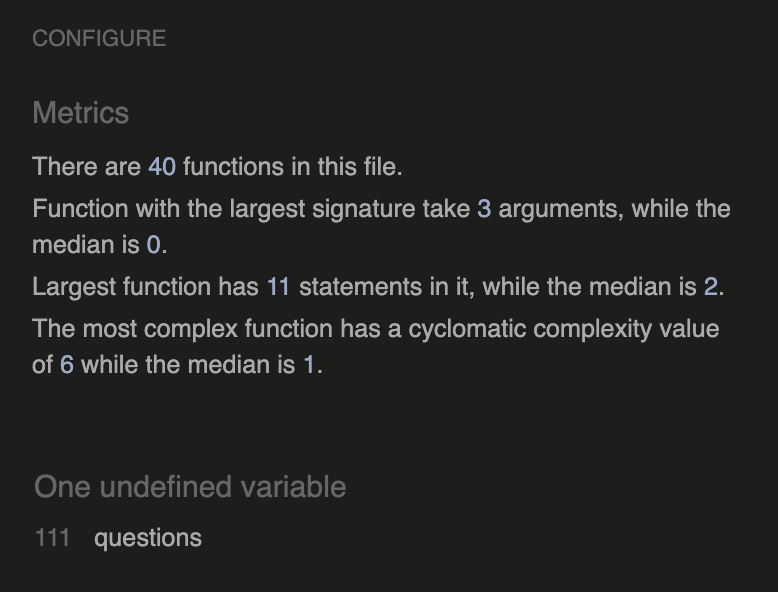
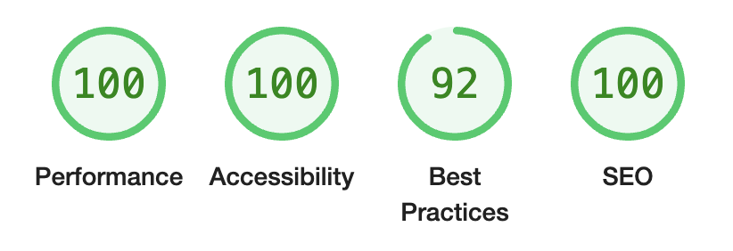

# Testing

Return back to the [README.md](README.md) file.

## Code Validation

### HTML

I have used the recommended [HTML W3C Validator](https://validator.w3.org) to validate all of my HTML files.

| Page | W3C URL | Screenshot | Notes |
| --- | --- | --- | --- |
| Home | [W3C](https://validator.w3.org/nu/?doc=https%3A%2F%2Fjamesh003.github.io%2FRocket-Launch%2F) |  | Pass: No Errors |
| Quiz | [W3C](https://validator.w3.org/nu/?doc=https%3A%2F%2Fjamesh003.github.io%2FRocket-Launch%2Fquiz.html) |  | Pass: No Errors |

### CSS

I have used the recommended [CSS Jigsaw Validator](https://jigsaw.w3.org/css-validator) to validate all of my CSS files.

| File | Jigsaw URL | Screenshot | Notes |
| --- | --- | --- | --- |
| style.css | [Jigsaw](https://jigsaw.w3.org/css-validator/validator?uri=https%3A%2F%2Fjamesh003.github.io%2FRocket-Launch%2Fquiz.html&profile=css3svg&usermedium=all&warning=1&vextwarning=&lang=en) |  | Pass: No Errors |


### JavaScript

I have used the recommended [JShint Validator](https://jshint.com) to validate all of my JS files.

| File | Screenshot | Notes |
| --- | --- | --- |
| script.js |  | One undefined variable
 |
| questions.js |  | One unused variable |

## Browser Compatibility

I've tested my deployed project on multiple browsers to check for compatibility issues.

| Browser | Screenshot | Notes |
| --- | --- | --- |
| Chrome |  | Works as expected |
| Firefox |  | Works as expected |
| Edge |  | Works as expected |
| Safari |  | Bug with rocket reappearing and twinkle not displaying properly |
| Safari |  | Bug with explosion just appearing instead of playing and no sound effects playing |
| Brave |  | Works as expected |
| Opera |  | Works as expected |

## Responsiveness

I've tested my deployed project on multiple devices to check for responsiveness issues.

| Device | Screenshot | Notes |
| --- | --- | --- |
| Mobile (DevTools) |  | Works as expected |
| Tablet (DevTools) |  | Works as expected |
| Desktop |  | Works as expected |
| iPhone 11 |  | Positioning error of rocket & height of image too long for viewport |
| iPhone 11 |  | Positioning error of rocket & height of image too long for viewport |
| iPhone 11 |  | Rocket reappears at top of viewport, no audio clips will play and twinkle gif just appears |


## Lighthouse Audit

I've tested my deployed project using the Lighthouse Audit tool to check for any major issues.

| Page | Size | Screenshot | Notes |
| --- | --- | --- | --- |
| Home | Mobile |  | No warnings |
| Home | Desktop |  | No warnings |
| Quiz | Mobile |  | Some minor warnings |
| Quiz | Desktop |  | No warnings |

## User Story Testing

| User Story | Screenshot |
| --- | --- |
| As a new site user, I would like to understand the purpose of the site, so that I can decide if I want to use it. |  |
| As a new site user, I would like to understand the aim of the game, so that I can maximise my chances |  |
| As a new site user, I would like to see strong enticing visuals, so that I can enjoy the experience. |  |
| As a new site user, I would like to readily understand the layout of the game/quiz, so that I don't waste time figuring it out.|  |
As a new site user, I would like to be able to control any sound, so that I can tailor my experience to my needs.|  |
As a new site user, I would like there to be an element of jeopardy to the game, to increase my gaming experience.|  |
| As a returning site user, I would like to have a random selection of quesions, so that I can attempt the game multiple times. |  |

## Bugs

- FontAwesome icons displaying as boxes

    

    - To fix this, I removed the font-family from `*::before, ::after` 
    and instead added it to 
    `* {
        font-family: Space Mono, Lato;
        }`

- Audio sound effects would play every time page reloaded

    

    - To fix this, I added 'muted' to each audio html tag.

- Timer starting as soon as page loaded.
    

    - To fix this, I moved this line `timerId = setInterval(countdown, 1000);` inside of the startQuiz function.

- Background image not changing between day and night scene in relation to timeOfDay function

    

    - To fix this, I changed the code to this ` bgImg.style.backgroundImage = "url('assets/images/bg-day.jpg')";`. By adding 'url()' it fixed the code.

- Rocket kept exploding when the timer would reach zero regardless of quantity of correct answers.
    

    - To fix this, I changed the code to this to target lack of correct scores instead of number of incorrect scores
    ```
    function countdown() {
    if (countdownTimer < 0 && correctScore < 5) {
        hideElements();
        initiateSelfDestruct();
    } else {
        timer.innerHTML = countdownTimer + ':00';
        countdownTimer--;
    }}
    ```

## Unfixed Bugs

<!-- ⚠️⚠️⚠️⚠️⚠️ START OF NOTES (to be deleted) ⚠️⚠️⚠️⚠️⚠️

You will need to mention unfixed bugs and why they were not fixed.
This section should include shortcomings of the frameworks or technologies used.
Although time can be a big variable to consider, paucity of time and difficulty understanding
implementation is not a valid reason to leave bugs unfixed.

If you've identified any unfixed bugs, no matter how small, be sure to list them here.
It's better to be honest and list them, because if it's not documented and an assessor finds the issue,
they need to know whether or not you're aware of them as well, and why you've not corrected/fixed them.

Some examples:

🛑🛑🛑🛑🛑 END OF NOTES (to be deleted) 🛑🛑🛑🛑🛑 -->

- On devices smaller than 375px, the page starts to have `overflow-x` scrolling.

    

    - Attempted fix: I tried to add additional media queries to handle this, but things started becoming too small to read.

- For PP3, when using a helper `clear()` function, any text above the height of the terminal does not clear, and remains when you scroll up.

    

    - Attempted fix: I tried to adjust the terminal size, but it only resizes the actual terminal, not the allowable area for text.

- When validating HTML with a semantic `section` element, the validator warns about lacking a header `h2-h6`. This is acceptable.

    

    - Attempted fix: this is a known warning and acceptable, and my section doesn't require a header since it's dynamically added via JS.

    | Safari |  | Bug with rocket reappearing and twinkle not displaying properly |
    | Safari |  | Bug with explosion just appearing instead of playing and no sound effects playing |
    | iPhone 11 |  | Positioning error of rocket & height of image too long for viewport |
    | iPhone 11 |  | Positioning error of rocket & height of image too long for viewport |
    | iPhone 11 |  | Rocket reappears at top of viewport, no audio clips will play and twinkle gif just appears |

There are no remaining bugs that I am aware of.
